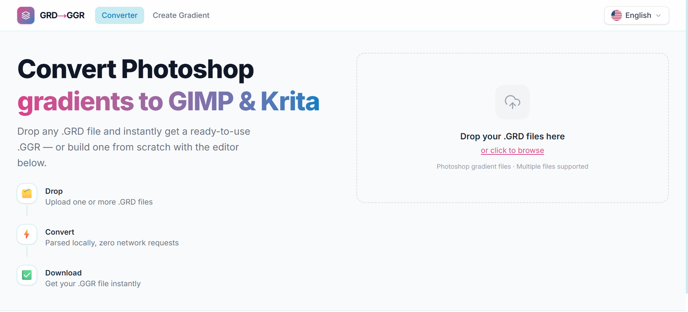
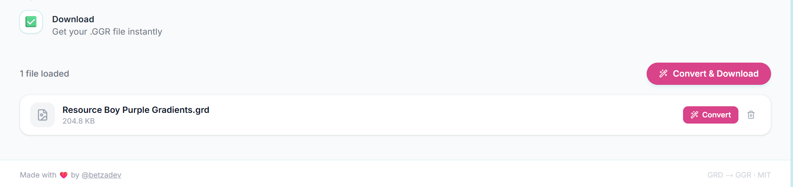
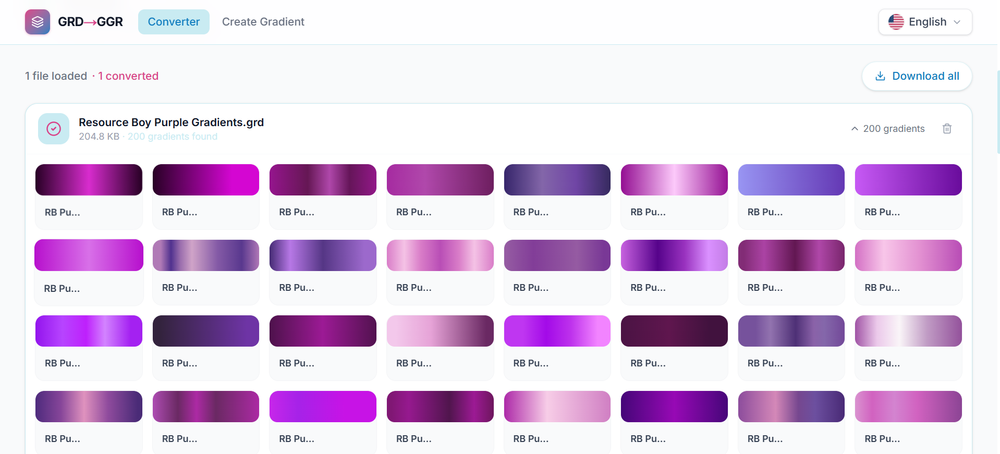
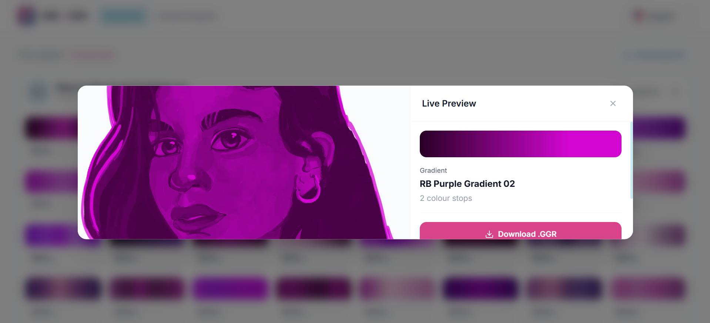
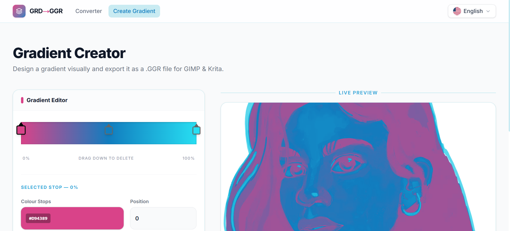
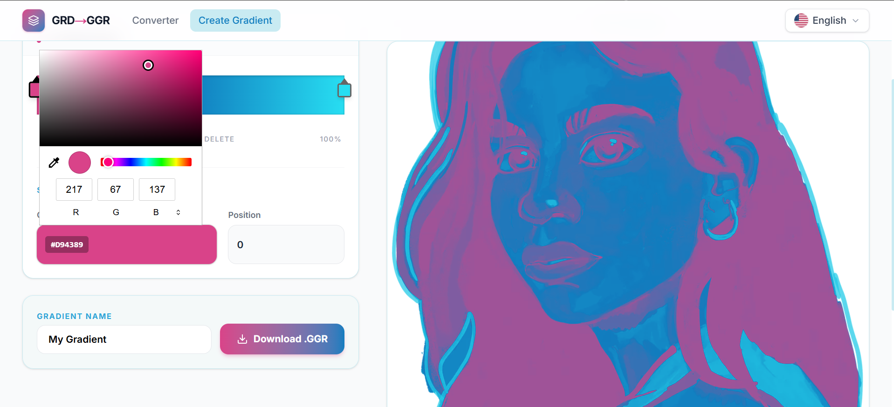
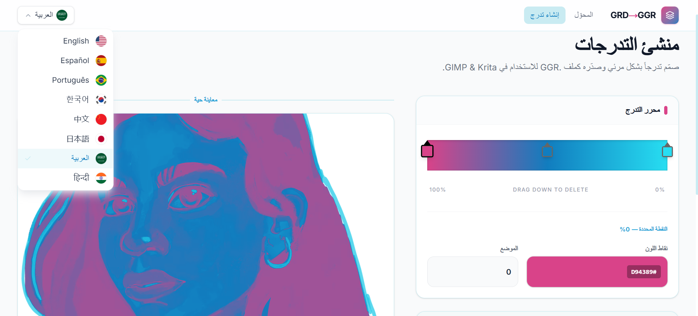

# GRD to GGR Converter 🚀

 

> ### 🎨 [Open GRDConverter](https://grdconverter.vercel.app/)

 

## 📝 Overview

**GRD to GGR Converter** is an open-source web application tailored for digital artists and designers. It seamlessly converts Adobe Photoshop gradient files (`.grd`) into the format used by GIMP and Krita (`.ggr`). The entire parsing process operates locally in the browser, ensuring zero network uploads and absolute privacy. It also features a built-in visual gradient editor structured like professional design tools.

## 🚀 Key Features

- **Local & Private Parsing:** Client-side conversion of `.grd` binaries.
- **Interactive Visual Editor:** Inspector-style UI with drag-to-delete handles.
- **Live Rendering:** Real-time gradient preview mapping via native SVG filters.
- **Multi-language Support:** Extensible i18n architecture.
- **Batch Extraction:** Unpack and export hundreds of gradients from a single file simultaneously.

## 📸 Screenshots

### Homepage & Converter

### Convert File

### Convert Preview

### Convert Live Preview

### Gradient Creator

### Built-in Color Picker

### Multi-language Support

## 💻 Usage Guide

### Converting `.grd` Files
1. Drag and drop your Photoshop `.grd` file into the main **Converter** page.
2. Preview all the extracted color swatches on your screen.
3. Click **Download all** to get your `.ggr` files ready for Krita.

### Designing from Scratch
1. Navigate to the **Create Gradient** tab.
2. Modify color stops through the visual slider and built-in color picker.
3. Name your gradient and click **Download .GGR**.

## 🤝 Contributing

We welcome community contributions!
1. Fork the project.
2. Create your feature branch (`git checkout -b feature/NewFeature`).
3. Commit your changes (`git commit -m 'feat: Add NewFeature'`).
4. Push to the branch (`git push origin feature/NewFeature`).
5. Open a Pull Request.

## 📄 License

This project is licensed under the MIT License.

---
Designed with ❤️ by [@betzadev](https://github.com/betzadev)
